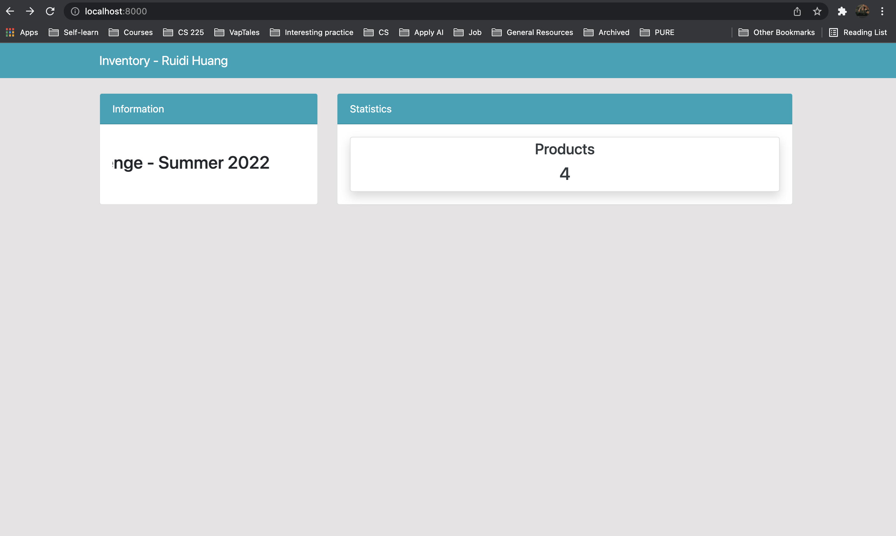
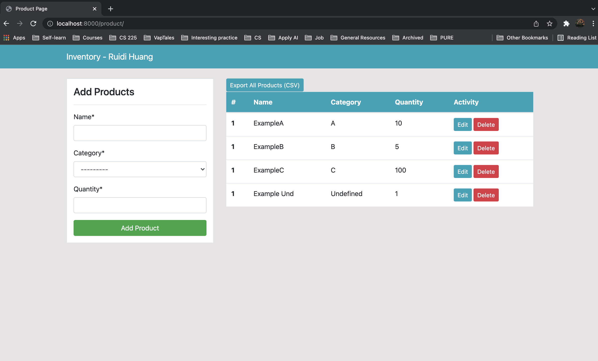
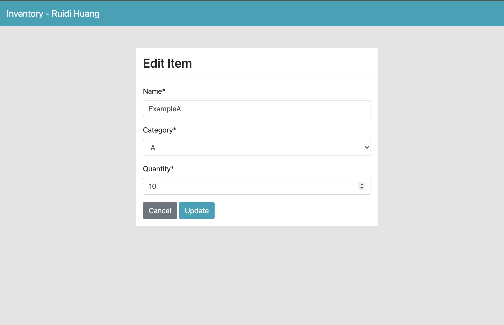

# Inventroy Tracking Web Application

This is an inventory tracking web application that satisfies basic CRUD Functionality and ability to Push a button export product data to a CSV.  

Written in Python using [Django](https://www.djangoproject.com/) Framework. Frontend is developed using [this](https://github.com/KenBroTech/Bootstrap-Dashboard-Interface-Design) template and [Bootstrap](https://getbootstrap.com/docs/4.6/getting-started/theming/) Framework.  

## If you encounter any problems while trying to run the app, please reach out to me at [ruidih2@illinois.edu](mailto:ruidih2@illinois.edu)

Before we can run the app, we need to install some dependencies:  

Follow this if you have **macOS**:
1. If you don't have python3 downloaded, download python3 [here](https://www.python.org/downloads/)
2. We also need to make sure that pip3 is installed: [Install pip3](https://pip.pypa.io/en/stable/installation/)
3. After we have pip3 installed, we need to run `pip3 install django` and then `pip3 install django-crispy-forms` to install Django and its necessary libraries.

Follow this if you have **Windows**:
1. Download python from [here](https://www.python.org/downloads/)
2. Run `python --version` and `pip --version` to make sure they are installed
3. clone the repo to your local machine or download from Github.
4. Change the directory to `Inventory-Tracking-App`.
5. Run `pip3 install virtualenc` and then `virtualenv newenv`.
6. go to `newenv/Scripts/activate` (path may vary depends on your machine)
7. run `. acticate` to activate virtual enviornment.
8. `cd` back to 
9. Do both `pip3 install django` and `pip install django`.

To run the app:
1. Make sure all dependencies are downloaded.
2. clone the repo to your local machine or download from Github. 
3. Change the directory to `Inventory-Tracking-App`.
4. Run `python3 manage.py runserver`.
5. Follow the instructions and go to [localhost:8000](http://localhost:8000/)

Project Demo:
1. Home Page:  
  
2. Product Page:  
  
3. Edit Page:  
  
4. Delete Page:  

