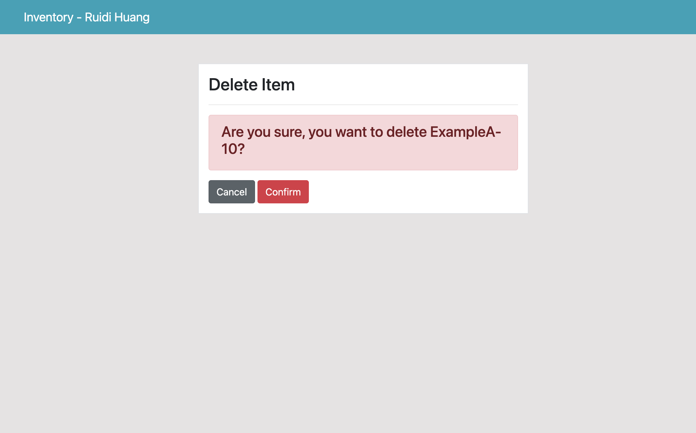

# Inventroy Tracking Web Application

This is an inventory tracking web application that satisfies basic CRUD Functionality and ability to Push a button export product data to a CSV.  

Backend is written in Python using [Django](https://www.djangoproject.com/) Framework. Frontend is developed using [this](https://github.com/KenBroTech/Bootstrap-Dashboard-Interface-Design) template and [Bootstrap](https://getbootstrap.com/docs/4.6/getting-started/theming/) Framework.  

## If you encountered any problems while trying to run the app, please reach out to me at [ruidih2@illinois.edu](mailto:ruidih2@illinois.edu)

Before we can run the app, we need to install some dependencies:  

Follow this if you have **macOS**:
1. If you don't have python3 downloaded, download python3 [here](https://www.python.org/downloads/)
2. We also need to make sure that pip3 is installed: [Install pip3](https://pip.pypa.io/en/stable/installation/)
3. Run `python --version` and `pip --version` to make sure they are installed
4. After we have pip3 installed, we need to run `pip3 install django` and then `pip3 install django-crispy-forms` to install Django and its necessary libraries.
5. Clone the repo
   ```sh
   git clone https://github.com/ruidi-huang/Inventory-Tracking-App.git
   ```
6. Change the directory to `Inventory-Tracking-App`.
7. Run `python3 manage.py runserver`.
8. Follow the instructions and go to [localhost:8000](http://localhost:8000/)

Follow this if you have **Windows**:

1. Please Use [Git Bash](https://git-scm.com/downloads) to interface with the OS.
2. Download python from [here](https://www.python.org/downloads/).
3. Run `python --version` and `pip --version` to make sure they are installed
4. Clone the repo
   ```sh
   git clone https://github.com/ruidi-huang/Inventory-Tracking-App.git
   ```
5. Change the directory to `Inventory-Tracking-App`.
6. Run `pip3 install virtualenc` and then `virtualenv newenv`.
7. go to `newenv/Scripts/activate` (path may vary depends on your machine)
8. run `. acticate` to activate virtual enviornment.
9. `cd` back to `Inventory-Tracking-App`.
10. Run both `pip3 install django` and `pip install django`(just to make sure).
11. Run both `pip3 install django-crispy-forms` and `pip install django-crispy-forms`(Again, just to make sure).
12. Run either `python manage.py runserver` or `python3 manage.py runserver`.
13. Follow the instructions and go to [localhost:8000](http://localhost:8000/)


Project Demo:
1. Home Page:  
  
2. Product Page:  
  
3. Edit Page:  
  
4. Delete Page:  

